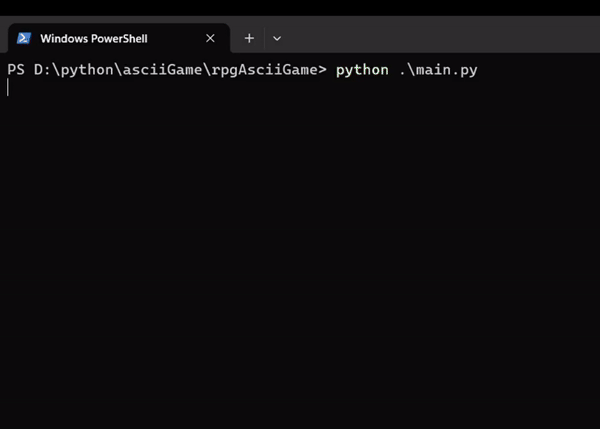

<h1>RPG ASCII Game Challenge</h1>

Welcome to the RPG ASCII Game Challenge repository! This project is aimed at creating a simple text-based RPG game with ASCII graphics. The initial version is implemented in Python and features random world generation, roads, random rooms, and character movement. The game runs on the default command line interface (Terminal, Command Prompt, PowerShell), making it easily accessible for all users.

<h2>Python Version</h2>

<h3>Features:</h3>
<ul>
    <li><strong>Random World Generation:</strong> Explore a dynamically generated world with each playthrough, making every game unique.</li>
    <li><strong>Roads:</strong> Navigate through roads that connect different parts of the world, adding structure to your journey.</li>
    <li><strong>Random Rooms:</strong> Encounter various randomly generated rooms as you explore the world, each with its own unique characteristics.</li>
    <li><strong>Character Movement:</strong> Move your character within the ASCII world, discovering new locations and challenges.</li>
</ul>

<h3>How to Run:</h3>

To run the game, open a command prompt or terminal window in the project directory and type the following command:

<code>python main.py</code>
 

<h3>Future Improvements:</h3>
<ul>
    <li><strong>Enemy Encounters:</strong> Add enemies to the world, creating combat scenarios for the player.</li>
    <li><strong>Quests and Objectives:</strong> Implement quests and objectives to give players a purpose and direction in the game.</li>
    <li><strong>Expanded World Features:</strong> Enhance the world with additional elements such as towns, dungeons, and more.</li>
</ul>

<h2>Next Steps</h2>

The next step in this project is to recreate the game in C++ and Java. This transition aims to reinforce programming concepts, improve code efficiency, and explore the nuances of a different programming language.

